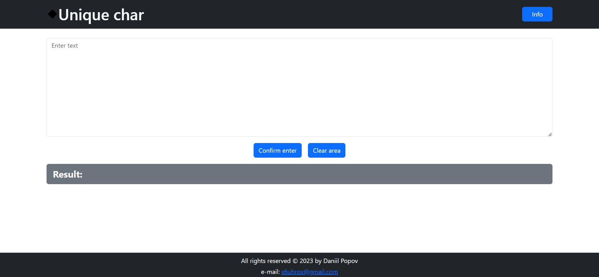

**Мова: [Українська](README.md), [English](README.en.md).**

## Зовнішній вигляд

## Опис проекту

Програма для пошуку унікального символу.

## Стек технологій:

## Інструкція з використання

1. Перейти за посиланням [Unique char]()
2. Ввести текст 
3. Натиснути `Confirm enter`
4. У полі `Result` - отриманий результат
5. Кнопка `Clear area` очистити поле вводу та результат
6. Кнопка `Info` - інформація о програмі

## Технічне завдання:

Потрібно розробити алгоритм програми, яка повинна виконувати наступне:
- програма приймає на вхід довільний текст і знаходить в кожному слові цього тексту найперший символ, який більше НЕ повторюється в аналізуємому слові
- далі із отриманого набору символів програма повинна вибрати перший унікальний (тобто той, який більше не зустручається в наборі) і повернути його.

Наприклад, якщо програма отримує на вхід текст нижче:

The Tao gave birth to machine language.  Machine language gave birth
to the assembler.
The assembler gave birth to the compiler.  Now there are ten thousand
languages.
Each language has its purpose, however humble.  Each language
expresses the Yin and Yang of software.  Each language has its place within
the Tao.
But do not program in COBOL if you can avoid it.
        -- Geoffrey James, "The Tao of Programming"

то повинна повернути вона символ "m".

Ви майже не обмежені у виборі методу і способу вирішення задачі. Ви можете використовувати будь-які засоби та підходи, лише дотримуючись двох обмежень, наведених нижче. Ви можете написати програму на будь-якій мові програмування чи використовувати вже існуючі програми та утіліти.

Існує 2 обмеження, які потрібно враховувати при виконанні:

### Обмеження #1:
Будь-яка людина повинна мати можливість використати ваш метод. Тобто, якщо для вирішення задачі ви використали власну програму, то інша людина повинна мати можливість її скомпілювати або запустити. Якщо ви використали сторонні програми, то інша людина теж повинна мати можливість ними скористатися.

### Обмеження #2:
при вирішенні задачі не можна використовувати нелегальне програмне забезпечення (пропрієтарне ПЗ, яке взломали, піратські копії тощо). Також якщо ви взяли ідею, ПЗ або вихідний код у друга/колеги/в інтернеті, потрібно вказати джерело.

### Додаткова умова:
- вкажіть також питання (якщо вони виникають), які ви би хотіли задати перед тим, як почати вирішувати задачу.

